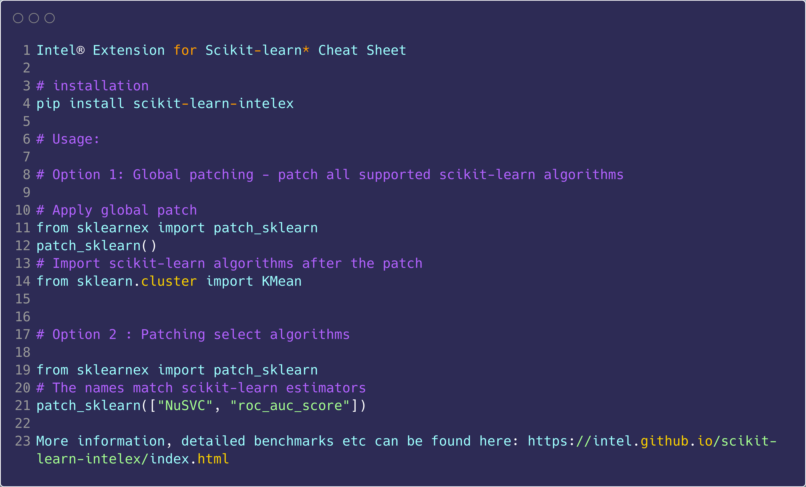

<h1>Intel&reg; AI in the Cloud</h1>

## Intel® Extension for Scikit-learn Cloud Deployment docs

## All notes are placeholders

## Cheat sheet




```bash
Docker image to use: docker pull bitnami/scikit-learn-intel:2021-debian-11
```

```python
import numpy as np

# patch scikit-learn
from sklearnex import patch_sklearn
patch_sklearn()

# Import scikit-learn algorithms after the patch
from sklearn.cluster import KMeans
```

# Deployment docs

//#TODO

## Architecture diagram

//#TODO

## Training docs

To test the service.

Setup up the server:

```python
└❯ cd ./ai_cloud
└❯ python ai_cloud/server.py 
python ai_cloud/server.py
```

This will start the server:

```bash
Intel(R) Extension for Scikit-learn* enabled (https://github.com/intel/scikit-learn-intelex)
INFO:     Started server process [145183]
INFO:     Waiting for application startup.
INFO:     Application startup complete.
INFO:     Uvicorn running on http://0.0.0.0:8000 (Press CTRL+C to quit)
```

To start the training please do:
curl -X POST \
  http:localhost:8000/train \
  -H 'Content-Type: application/json' \
  -d '{"path":"<path_to_data>", "num_samples": <number_of_samples>}'


## Inference deployment docs


//#TODO

# Contribution guidelines


//#TODO

# Security
