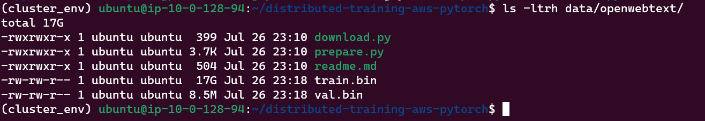
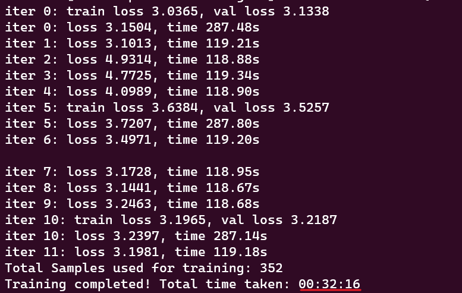
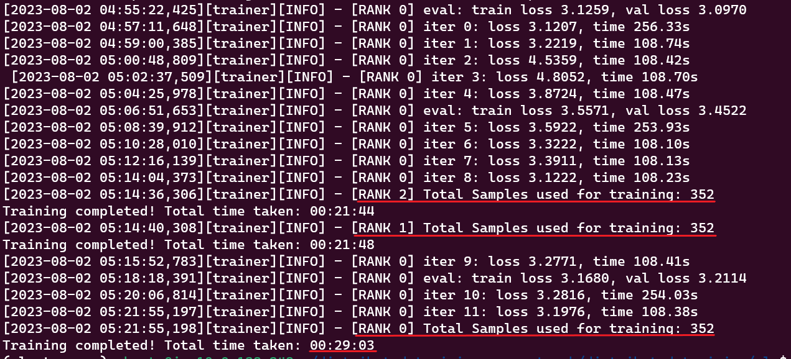

<p align="center">
  
</p>

# Intel® Cloud Optimization Modules for AWS: GPT2-Small Distributed Training
The Intel Cloud Optimization Modules (ICOMs) are open-source codebases with codified Intel AI software  optimizations and instructions built specifically for each Cloud Service Provider (CSP).  The ICOMs are built with production AI developers in mind, leveraging popular AI frameworks within the context of cloud services.

## Introduction

LLMs (Large Language Models) are becoming ubiquitous, but in many cases, you don't need the full capability of the latest GPT model. Additionally, when you have a specific task at hand, the performance of the biggest GPT model might not be optimal. Often, fine-tuning a small LLM on your dataset is sufficient. In this guide, you will learn how to fine-tune a [GPT2-small](https://huggingface.co/gpt2) (124M parameter) model on a cluster of CPUs on AWS. The objective here is not to arrive at a chatGPT-like AI model, but rather to understand how to set up distributed training so that you can fine-tune to your specific objective. The end result of training here will result in a base LLM that can generate words (or tokens), but it will only be suitable for your use-case when you train it on your specific task and dataset.

The GPT2-Small model will be trained on the [OpenWebText](https://huggingface.co/datasets/Skylion007/openwebtext) dataset in a distributed setting, using 3rd or 4th Gen. Intel® Xeon® Scalable Processors. The project builds upon the initial codebase of [nanoGPT](https://github.com/karpathy/nanoGPT), by Andrej Karpathy.


## Table of Contents
1. [AWS Prerequisites](#1-aws-prerequisites): Ensure that the correct AWS and hardware prerequisites are in place.
2. [Install Dependencies](#2-install-dependencies): Begin by installing the necessary dependencies and ensure that all required libraries and tools are setup correctly.
3. [Download the OpenWebText Data and Train on a Single CPU](#3-download-the-openwebtext-data-and-train-on-a-single-cpu): Obtain the OpenWebText dataset from Hugging Face Hub. Preprocess and format the data appropriately for compatibility with nanoGPT implementation. Optionally, save both the raw and preprocessed data in an AWS S3 storage bucket. Test the fine-tuning script on a single CPU to understand the basic workflow and to make all dependencies are installed correctly.
4. [Preparing for Distributed Training](#4-preparing-for-distributed-training): Configuring the necessary infrastructure like EC2 instances and security groups for distributed training on multiple CPUs. 
5. [Fine-Tuning on Multiple CPUs](#5-fine-tuning-on-multiple-cpus): Once the distributed training environment is ready, perform fine-tuning on the cluster of Xeon CPUs to train the model quickly.
6. [Running Inference](#6-running-inference): Just as a quick inference example, we will run 1 sample through our trained model to generate some new text.
7. [Cleaning Up AWS Resources](#7-cleaning-up-aws-resources): Shut down EC2 instances, delete security groups, and erase S3 storage.
8. [Follow Up](#8-follow-up): Register for office hours and much more!

## 1. AWS Prerequisites
Before proceeding, ensure you have an AWS account and the necessary permissions to launch EC2 instances, create Amazon Machine Images (AMIs), create security groups, and create S3 storage buckets.

We used 3x [*m6i.4xlarge* EC2 instances](https://aws.amazon.com/ec2/instance-types/m6i/) with Ubuntu 22.04 and 250 GB of storage each. The *m6i.4xlarge* instances have 16 vCPUs and 64 GB of memory. However, if you have access to 4th Gen. Xeon CPUs ([*R7iz*](https://aws.amazon.com/ec2/instance-types/r7iz/)) on AWS, these have significant additional built-in accelerations for deep learning, like [Advanced Matrix Instructions (AMX)](https://www.intel.com/content/www/us/en/products/docs/accelerator-engines/advanced-matrix-extensions/overview.html). To maximize performance during fine-tuning, we recommend using `bfloat16` precision when using 4th Gen. Xeon CPUs

In order to get started, you must first launch an EC2 instance and open it up in a command prompt. You can do so from the AWS console with the instructions that are found [here](https://docs.aws.amazon.com/AWSEC2/latest/UserGuide/ec2-launch-instance-wizard.html).

If you are using a 4th Gen. Xeon CPU, you can verify that you have the AMX instruction set by running:

```bash
lscpu | grep amx
```

and you should see the following flags:

```
amx_bf16 amx_tile amx_int8
```

These flags indicate that the AMX instructions are available on your system, which are essential for leveraging mixed precision training and using `bfloat16`. Please keep in mind that, for now, the AMX instruction set is only supported by 4th Gen. Xeon CPUs.

[Back to Table of Contents](#table-of-contents)


## 2. Install Dependencies

You are ready to set up the environment for fine-tuning the GPT2-small model.

Update the package manager and install [tcmalloc](https://github.com/google/tcmalloc) for extra performance

```bash
sudo apt update
sudo apt install libgoogle-perftools-dev unzip -y
```

(Optional) If you wish to upload your dataset and processed files to S3, you can install AWS CLI. First, download and unzip the AWS CLI package:
```bash
curl "https://awscli.amazonaws.com/awscli-exe-linux-x86_64.zip" -o "awscliv2.zip" && unzip awscliv2.zip
```

Then, install AWS CLI using the provided script:
```bash
sudo ./aws/install
```

Ensure that the AWS CLI was installed properly by running the following:
```bash
aws --version
```

If you see the version details, that means you have succesfully installed AWS CLI. Remember to clean thing up after installation:
```bash
rm -r awscliv2.zip aws
```

To configure your AWS CLI with your credentials, you can run:
```bash
aws configure
```

Now let's set up a conda environment for fine-tuning GPT. First, download and install conda based on your operating system. You can find the download instructions [here](https://www.anaconda.com/download#downloads). The current commands for Linux are:

```bash
wget https://repo.anaconda.com/archive/Anaconda3-2023.07-1-Linux-x86_64.sh
bash ./Anaconda3-2023.07-1-Linux-x86_64.sh
```

To begin using conda, you have two options: restart the shell or execute the following command:
```bash
source ~/.bashrc
```

Running this command will source the ~/.bashrc file, which has the same effect as restarting the shell. This enables you to access and use conda for managing your Python environments and packages seamlessly.

Once conda is installed, create a virtual environment and activate it:

```bash
conda create -n cluster_env python=3.10
conda activate cluster_env
```

We have now prepared our environment and can move onto downloading data and training our GPT2-small model.

[Back to Table of Contents](#table-of-contents)


## 3. Download the OpenWebText Data and Train on a Single CPU

Clone this repo and install its dependencies:

```bash
git clone https://github.com/intel/intel-cloud-optimizations-aws
cd intel-cloud-optimizations-aws/distributed-training/nlp/src
pip install -r requirements.txt
```

In order to run distributed training, you can use the Intel® oneAPI Collective Communications Library (oneCCL). Download the **appropriate** wheel file and install it using the following commands:

```bash
wget https://intel-extension-for-pytorch.s3.amazonaws.com/torch_ccl/cpu/oneccl_bind_pt-1.13.0%2Bcpu-cp310-cp310-linux_x86_64.whl
pip install oneccl_bind_pt-1.13.0+cpu-cp310-cp310-linux_x86_64.whl
```

And you can delete the wheel file after installation:
```bash
rm oneccl_bind_pt-1.13.0+cpu-cp310-cp310-linux_x86_64.whl
```

Next, you can move onto downloading and processing the full OpenWebText dataset. This is all accomplished with one script.

```bash
python data/openwebtext/prepare.py --full
```

> **Note**: The script can also upload both the raw data and processed files to S3. Ensure that you have prepared a S3 bucket before running this script. You also need to pass the bucket name to the script using `--bucket` argument as follows 

```bash
python data/openwebtext/prepare.py --full --bucket <bucket_name>
```

The complete dataset takes up approximately 54GB in the Hugging Face `.cache` directory and contains about 8 million documents (8,013,769). During the tokenization process, the storage usage might increase to around 120GB. The entire process can take anywhere from 1 to 3 hours, depending on your CPU's performance.

Upon successful completion of the script, two files will be generated:

1. `train.bin`: This file will be approximately 17GB (~9B tokens) in size.
2. `val.bin`: This file will be around 8.5MB (~4M tokens) in size.

You should be able to run 
```bash
ls -ltrh data/openwebtext/
``` 
and see the output like:

 


For future use on other systems, you can directly download the processed BIN files from S3 by executing [download.py](data/openwebtext/download.py) script. Follow the previous steps, and instead of running [prepare.py](data/openwebtext/prepare.py), execute the [download.py](data/openwebtext/download.py) script as follows:

```bash
python data/openwebtext/download.py --bucket <bucket_name>
```

To streamline the training process, we will use the [Hugging Face Accelerate library](https://huggingface.co/docs/accelerate/index). Once you have the processed `.bin` files, you are ready to generate the training config file by running the following accelerate command:

```bash
accelerate config --config_file ./single_config.yaml
```

When you run the above command, you will be prompted to answer a series of questions to configure the training process. Here's a step-by-step guide on how to proceed:

First, select `This machine` as we are not using Amazon SageMaker.
```bash
In which compute environment are you running?
Please select a choice using the arrow or number keys, and selecting with enter
 ➔  This machine
    AWS (Amazon SageMaker)
```

Next, since we are initially running the script on a single machine, select **No distributed training**. 

```bash
Which type of machine are you using?
Please select a choice using the arrow or number keys, and selecting with enter
 ➔  No distributed training
    multi-CPU
    multi-XPU
    multi-GPU
    multi-NPU
    TPU
```

You will be prompted to answer a few of yes/no questions.  Here are the prompts and answers:
```bash
Do you want to run your training on CPU only (even if a GPU / Apple Silicon device is available)? [yes/NO]:yes
Do you want to use Intel PyTorch Extension (IPEX) to speed up training on CPU? [yes/NO]:yes
Do you wish to optimize your script with torch dynamo?[yes/NO]:NO
Do you want to use DeepSpeed? [yes/NO]: NO
```
At the very end, you will be asked to select mixed precision. Select `bf16` on 4th Gen. Xeon CPUs; otherwise, you can select `fp16`.

```bash
Do you wish to use FP16 or BF16 (mixed precision)?
Please select a choice using the arrow or number keys, and selecting with enter
    no   
 ➔  fp16
    bf16
    fp8
```

This will generate a config file and save it as `single_config.yaml` in your current working directory.

We are now ready to start fine-tuning the GPT2-small model. To start the finetuning process, you can run the `main.py` script. But instead of running it directly, you can use the `accelerate launch` command along with the generated config file because `accelerate` automatically selects the appropriate number of cores, device, and mixed precision settings based on the configuration file, streamlining the process and optimizing performance. You can begin training at this point with:


```bash
accelerate launch --config_file ./single_config.yaml main.py
```

This command will initiate the fine-tuning process, utilizing the settings specified in the `single_config.yaml` file.

> **Note**: By default, [main.py](main.py) uses the [gpt2_train_cfg.yaml](gpt2_train_cfg.yaml) training configuration file: 

```yaml
data_dir: ./data/openwebtext

block_size: 1024
  
optimizer_config:
  learning_rate: 6e-4
  weight_decay: 1e-1
  beta1: 0.9
  beta2: 0.95

trainer_config:
  device: cpu
  mixed_precision: bf16 # fp32 or bf16.
  eval_interval: 5    # how frequently to perform evaluation
  log_interval: 1     # how frequently to print logs
  eval_iters: 2       # how many iterations to perform during evaluation
  eval_only: False
  batch_size: 32
  max_iters: 10       # total iterations
  model_path: ckpt.pt 
  snapshot_path: snapshot.pt
  gradient_accumulation_steps: 2 
  grad_clip: 1.0
  decay_lr: True
  warmup_iters: 2
  lr_decay_iters: 10
  max_lr: 6e-4
  min_lr: 6e-5
  ```

You can review the file for `batch_size`, `device`, `max_iters`, etc. and make changes as needed. If you prefer to use a different configuration file, you can make one and give it a new name like `new_config.yaml` and pass it to `main.py` using the `--config-name` flag as follows: 

```bash
accelerate launch --config_file ./single_config.yaml main.py --config-name new_config.yaml
```

> **Note**: Accelerate by default will use the maximum number of physical cores (virtual cores excluded) by default. For experimental reasons, to control the number of threads, you can set `--num_cpu_threads_per_process` to the number of threads you wish to use. For example, if you want to run the script with only 4 threads:

```bash
accelerate launch --config_file ./single_config.yaml --num_cpu_threads_per_process 4 main.py
```

The script will train the model for a specified number of `max_iters` iterations and perform evaluations at regular `eval_interval`. If the evaluation score surpasses the previous model's performance, the current model will be saved in the current working directory under the name `ckpt.pt`. It will also save the snapshot of the train progress under the name `snapshot.pt`. You can easily customize these settings by modifying the values in the [gpt2_train_cfg.yaml](gpt2_train_cfg.yaml) file.

We performed 10 iterations of training, successfully completing the process. During this training, the model was trained on a total of 320 samples. This was achieved with a batch size of 32 and taking approximately 32 minutes to complete.



The total dataset consists of approximately 8  million training samples, which would take a lot longer to train. However, the OpenWebText dataset was not built for a downstream task -- it is meant to replicate the entire training dataset used for the base model of GPT-2. There are many smaller datasets like the [Alpaca dataset](https://huggingface.co/datasets/tatsu-lab/alpaca) (with 52K samples) that would be quite feasible on a distributed setup similar to the one described here.

> **Note**: In this fine-tuning process, we have opted not to use the standard PyTorch DataLoader. Instead, we have implemented a `get_batch` method that returns a batch of random samples from the dataset each time it is called. This implementation has been directly copied from the nanoGPT implementation. </br> Due to this specific implementation, we do not have the concept of epochs in the training process and instead are using iterations, where each iteration fetches a batch of random samples.

Next, we need to prepare a new `accelerate` config for multi-CPU setup. But before setting up the multi-CPU environment, ensure you have the IP address of your machine handy. To obtain it, run the following command:

```bash
hostname -i
```

With the IP address ready, execute the following command to generate the new accelerate config for the multi-CPU setup:
```bash
accelerate config --config_file ./multi_config.yaml
```

When configuring the multi-CPU setup using `accelerate config`, you will be prompted with several questions. To select the appropriate answers based on your environment. Here's a step-by-step guide on how to proceed:

First, select `This machine` as we are not using Amazon SageMaker. 

```bash
In which compute environment are you running?
Please select a choice using the arrow or number keys, and selecting with enter
 ➔  This machine
    AWS (Amazon SageMaker)
```

Choose `multi-CPU` as the type of machine for our setup.

```bash
Which type of machine are you using?
Please select a choice using the arrow or number keys, and selecting with enter
    No distributed training       
 ➔  multi-CPU
    multi-XPU
    multi-GPU
    multi-NPU
    TPU
```

Next, you can enter the number of instances you will be using. For example, here we have 3 (including the master node). 

```bash
How many different machines will you use (use more than 1 for multi-node training)? [1]: 
```

Concerning the rank, since we are initially running this from the master node, enter `0`. For each machine, you will need to change the rank accordingly.

```bash
What is the rank of this machine?
Please select a choice using the arrow or number keys, and selecting with enter
 ➔  0
    1
    2
```

Next, you will need to provide the private IP address of the machine where you are running the `accelerate launch` command, that we found earlier with `hostname -i`.

```bash
What is the IP address of the machine that will host the main process?   
```

Next, you can enter the port number to be used to communication. Commonly used port is 29500, but you can choose any available port. 

```bash
What is the port you will use to communicate with the main process?   
```

You will be prompted with a few more questions. Provide the required information as per your setup.

The prompt of
```bash
How many CPU(s) should be used for distributed training?
```
is actually about CPU sockets. Generally, each machine will have only 1 CPU socket. However, in the case of bare metal instances, you may have 2 CPU sockets per instance. Enter the appropriate number of sockets based on your instance configuration.

After completing the configuration, you will be ready to launch the multi-CPU fine-tuning process. The final output should look something like:


```bash
------------------------------------------------------------------------------------------------------------------------------------------
In which compute environment are you running?
This machine
------------------------------------------------------------------------------------------------------------------------------------------
Which type of machine are you using?
multi-CPU
How many different machines will you use (use more than 1 for multi-node training)? [1]: 3
------------------------------------------------------------------------------------------------------------------------------------------
What is the rank of this machine?
0
What is the IP address of the machine that will host the main process? xxx.xxx.xxx.xxx
What is the port you will use to communicate with the main process? 29500
Are all the machines on the same local network? Answer `no` if nodes are on the cloud and/or on different network hosts [YES/no]: no
What rendezvous backend will you use? ('static', 'c10d', ...): static
Do you want to use Intel PyTorch Extension (IPEX) to speed up training on CPU? [yes/NO]:yes
Do you wish to optimize your script with torch dynamo?[yes/NO]:NO
How many CPU(s) should be used for distributed training? [1]:1
------------------------------------------------------------------------------------------------------------------------------------------
Do you wish to use FP16 or BF16 (mixed precision)?
bf16
```

You now should have generated a new config file named `multi_config.yaml` in your current working directory. Before creating an AMI from this volume, make sure to delete the `snapshot.pt` file. If this file exists, the `main.py` script will resume training from the snapshot, which might not be desired when creating an AMI.

```bash
rm snapshot.pt
```

[Back to Table of Contents](#table-of-contents)

## 4. Preparing for Distributed Training

Now that we have this running in a single system, let's try to run it on multiple systems. To prepare for distributed training and ensure a consistent setup across all systems, follow these steps:

1. **Create an AMI**: Start by creating an Amazon Machine Image (AMI) from the existing instance where you have successfully run the fine-tuning on a single system. This AMI will capture the entire setup, including the dependencies, configurations, codebase, and dataset. To create an AMI, refer to [Create a Linux AMI from an instance](https://docs.aws.amazon.com/AWSEC2/latest/UserGuide/creating-an-ami-ebs.html#:~:text=EBS%20volumes.-,Create%20a%20Linux%20AMI%20from%20an%20instance,-You%20can%20create).

2. **Security Group**: While waiting for the AMI creation, let's continue by creating a security group that enables communication among the member nodes. This security group should be configured to allow inbound and outbound traffic on the necessary ports for effective communication between the master node and the worker nodes.

    In the security group configuration, ensure that you have allowed *all* traffic originating from the security group itself. This setting allows seamless communication between the instances within the security group.

    Please refer to the following screenshot as an example:

    

    By setting up the security group in this manner, you ensure that all necessary traffic can flow between the master node and the worker nodes during distributed training.

3. **Launch new instances**: Use the created AMI to launch new instances, specifying the desired number of instances based on the number of systems you want to use for distributed training. This ensures that all the instances have the same environment and setup. To initiate new EC2 instances, there are two options available: using the AWS console, or AWS CLI. If you have AWS CLI configured, you can launch instances by executing the following command:

    ```bash
    aws ec2 run-instances --image-id ami-xxxxxxxx --count 2 --instance-type m6i.4xlarge --key-name <MyKeyPair> --security-group-ids sg-xxxxxxxx --subnet-id subnet-xxxxxx
    ```
    replacing the X's with the numbers associated to your AWS configurations, and replacing `<MyKeyPair>` with your key pair.
    
4. **Passwordless SSH**: Set up passwordless SSH from the master node to all the worker nodes. To enable passwordless SSH, configure the master instance's SSH public key to be authorized on all other nodes. This will ensure SSH access without prompts between the master and worker nodes. To enable passwordless SSH, follow these steps:

    1. **Verify SSH Access**: First, check if you can SSH into the other nodes from the master node. Use the private IP address and the appropriate username for each node.

        ```bash
        ssh <username>@<ip-address>
        ```

        Successful SSH connections will indicate that the inbound rules of the security group are correctly set up. In case of any issues, check the network settings.

    2. **Generate SSH Key Pair**: On the master node, run the following command to generate an SSH key pair:

        ```bash
        ssh-keygen
        ```

        You will be prompted to enter a passphrase for the key. You can choose to enter a passphrase or leave it blank for no passphrase. For simplicity in this guide, it is recommended to leave it blank. The key pair will be generated and saved in the `~/.ssh` directory, with two files: `~/.ssh/id_rsa` (private key) and `~/.ssh/id_rsa.pub` (public key). For security, set appropriate permissions on the private key:

        ```bash
        chmod 600 ~/.ssh/id_rsa
        ```

    3. **Propagate the Public Key to Remote Systems**: To transfer the public key to the remote hosts, use the `ssh-copy-id` command. If password authentication is currently enabled, this is the easiest way to copy the public key:

          ```bash
          ssh-copy-id <username>@<private-ip-address>
          ```

          This command will copy the public key to the specified remote host. You will have to run this command from the master node to copy the public key to all other nodes.

    4. **Verify Passwordless SSH**: After copying the public key to all nodes, verify that you can connect using the key pair:

          ```bash
          ssh <username>@<private-ip-address>
          ```

          If you can successfully log in without entering a password, it means passwordless SSH is set up correctly.

    By following above steps, you will establish passwordless SSH between the master node and all worker nodes, ensuring smooth communication and coordination during distributed training. If you encounter any difficulties, additional information can be found [here](https://www.redhat.com/sysadmin/passwordless-ssh).

Next, to continue setting up the cluster, you will need to edit the SSH configuration file located at `~/.ssh/config` on the master node. The configuration file should look like this:

```plaintext
Host 10.*.*.*
   StrictHostKeyChecking no

Host node1
    HostName 10.0.xxx.xxx
    User ubuntu

Host node2
    HostName 10.0.xxx.xxx
    User ubuntu
```

The `StrictHostKeyChecking no` line disables strict host key checking, allowing the master node to SSH into the worker nodes without prompting for verification.

With these settings, you can check your passwordless SSH by executing `ssh node1` or `ssh node2` to connect to any node without any additional prompts.

Additionally, on the master node, you will create a host file (`~/hosts`) that includes the names of all the nodes you want to include in the training process, as defined in the SSH configuration above. Use `localhost` for the master node itself as you will launch the training script from the master node. The `hosts` file will look like this:

```plaintext
localhost
node1
node2
```

This setup will allow you to seamlessly connect to any node in the cluster for distributed training.

[Back to Table of Contents](#table-of-contents)


## 5. Fine-Tuning on Multiple CPUs

Before beginning the fine-tuning process, it is important to update the `machine_rank` value on each machine. Follow these steps for each worker machine:

1. SSH into the worker machine.
2. Locate and open the `multi_config.yaml` file.
3. Update the value of the `machine_rank` variable in the file. Assign the rank to the worker nodes starting from 1.
   - For the master node, set the rank to 0.
   - For the first worker node, set the rank to 1.
   - For the second worker node, set the rank to 2.
   - Continue this pattern for additional worker nodes.

By updating the `machine_rank`, you ensure that each machine is correctly identified within the distributed training setup. This is crucial for the successful execution of the fine-tuning process.

To train PyTorch models in a distributed setting on Intel hardware, we utilize Intel's MPI (Message Passing Interface) implementation. This implementation provides flexible, efficient, and scalable cluster messaging on Intel architecture. The Intel® oneAPI HPC Toolkit includes all the necessary components, including `oneccl_bindings_for_pytorch`, which is installed alongside the MPI toolset.

To use `oneccl_bindings_for_pytorch`, you simply need to source the environment by running the following command:

```bash
oneccl_bindings_for_pytorch_path=$(python -c "from oneccl_bindings_for_pytorch import cwd; print(cwd)")
source $oneccl_bindings_for_pytorch_path/env/setvars.sh
```

This command sets up the environment variables required for utilizing `oneccl_bindings_for_pytorch` and enables distributed training using Intel MPI. 

> **Note**: In a distributed setting, `mpirun` can be used to run any program, not just for distributed training. It allows you to execute parallel applications across multiple nodes or machines, leveraging the capabilities of MPI (Message Passing Interface).

Finally, it's time to run the fine-tuning process on multi-CPU setup. The following command be used to launch distributed training:
```bash
mpirun -f ~/hosts -n 3 -ppn 1 -genv LD_PRELOAD="/usr/lib/x86_64-linux-gnu/libtcmalloc.so" accelerate launch --config_file ./multi_config.yaml --num_cpu_threads_per_process 8 main.py 
```

Some notes on the arguments for `mpirun` to consider:
- `-n`: This parameter represents the number of CPUs or nodes. In our case, we specified `-n 3` to run on 3 nodes. Typically, it is set to the number of nodes you are using. However, in the case of bare metal instances with 2 CPU sockets per board, you would use `2n` to account for the 2 sockets.
- `-ppn`: The "process per node" parameter determines how many training jobs you want to start on each node. We only want 1 instance of each training to be run on each node, so we set this to `-ppn 1`. 
- `-genv`: This argument allows you to set an environment variable that will be applied to all processes. We used it to set the `LD_PRELOAD` environment variable to use the `libtcmaclloc` performance library.
- `num_cpu_threads_per_process`: The `num_cpu_threads_per_process` argument specifies the number of CPU threads that PyTorch will use per process. We set this to use 8 threads in our case. When running deep learning tasks, it is best practice to use only the physical cores of your processor (which in our case is 8). 

Here is what the final output for distributed training would look like. 



By adopting distributed training techniques, we witness a remarkable improvement in data processing efficiency. In approximately 29 minutes, we process three times the amount of data as compared to non-distributed training methods. Additionally, we get a lower loss value indicating better model generalization. This substantial speed boost and better generalization is a testament to the immense advantages of leveraging distributed training. Distributed training is of paramount importance in modern machine learning and deep learning scenarios. Its significance lies in the following aspects:

- Faster Training: As demonstrated in the output, distributed training significantly reduces the training time for large datasets. It allows parallel processing across multiple nodes, which accelerates the training process and enables efficient utilization of computing resources.

- Scalability: With distributed training, the model training process can easily scale to handle massive datasets, complex architectures, and larger batch sizes. This scalability is crucial for handling real-world, high-dimensional data.

- Model Generalization: Distributed training enables access to diverse data samples from different nodes, leading to improved model generalization. This, in turn, enhances the model's ability to perform well on unseen data.

Training the model on the Alpaca Dataset using a single CPU is estimated to take around 87 hours, approximately 3.5 days. However, the advantage of utilizing a distributed cluster with 3 CPUs becomes apparent, as the training duration can be reduced to less than 30 hours. This represents a significant improvement in efficiency, showcasing that a distributed setup can facilitate the rapid fine-tuning of Large Language Model (LLMs) on private datasets containing 50K - 100K samples in just a matter of days. 

Overall, distributed training is an indispensable technique that empowers data scientists, researchers, and organizations to efficiently tackle complex machine learning tasks and achieve superior results. 

## 6. Running Inference

One last thing before we sign-off. Now that we have trained our model, let's try to generate some text.  

```bash
python sample.py --ckpt_path=ckpt.pt
```

The script is designed to generate sample text containing 100 tokens. By default, the input prompt for generating these samples is the `It is interesting ` character. However, you also have the option to specify your own prompt by using the `--prompt` argument as follows:

```bash
python sample.py --ckpt_path=ckpt.pt --prompt="This is new prompt "
```

Below is one sample generated text from the `It is interesting ` input:

```
Input Prompt: It is interesting
--------------- Generated Text ---------------
It is interesting that the government has a good idea of what the government is doing, and it does it. 
I don't think the government has a good idea of what the government is doing. 
I don't think the government has a good idea of what the government is doing.

I think the government has a good idea of what the government is doing, and it does it.

The second is that the government is not the government. The government is not the government.

----------------------------------------
```


This example does illustrate that the language model can generate text, but it is not useful in its current form until fine-tuned on downstream tasks. While there is repetition in the tokens here, this module's primary focus was on the successful distributed training process and leveraging the capabilities of the Intel hardware effectively.

During the fine-tuning process on the cluster of three 3rd Gen. Xeon CPUs, we successfully trained the GPT2-small model. The performance achieved is notable, and is expected to perform at around 3x this rate when using 4th Gen. Xeon CPUs. 

[Back to Table of Contents](#table-of-contents)

## 7. Cleaning up AWS Resources

Ensure that you properly remove and clean up all the resources created during the course of following this module. To delete EC2 instances and a security group using the AWS CLI, you can use the following commands:

1. Delete EC2 instances:
```bash
aws ec2 terminate-instances --instance-ids <instance_id1> <instance_id2> ... <instance_idN>
```
Replace `<instance_id1>`, `<instance_id2>`, ..., `<instance_idN>` with the actual instance IDs you want to terminate. You can specify multiple instance IDs separated by spaces.

2. Delete Security Group:
```bash
aws ec2 delete-security-group --group-id <security_group_id>
```
Replace `<security_group_id>` with the ID of the security group you want to delete.

Please be cautious when using these commands, as they will permanently delete the specified EC2 instances and security group. Double-check the instance IDs and security group ID to avoid accidental deletions.

3. Delete S3 storage
If you saved any data to an S3 bucket, you can delete the data with the following command:
```bash
aws s3 rm s3://<bucket>/folder --recursive
```
where `<bucket>` is your particular S3 storage bucket.

[Back to Table of Contents](#table-of-contents)

## 8. Follow Up

1. [Register for Office Hours here](https://software.seek.intel.com/SupportFromIntelExperts-Reg) for help on your ICOM implementation.

2. Learn more about all of our [Intel Cloud Optimization Modules here](https://www.intel.com/content/www/us/en/developer/topic-technology/cloud-optimization.html).

3. Come chat with us on our [Intel DevHub Discord](https://discord.gg/rv2Gp55UJQ) server to keep interacting with fellow developers.

4. Stay connected with us on social media:

- Ankur Singh | AI Solutions Engineer Intern | [LinkedIn](https://www.linkedin.com/in/ankur-singh-ml/)
- Benjamin Consolvo | AI Community Enablement Manager | [LinkedIn](https://linkedin.com/in/bconsolvo) | [Twitter](https://twitter.com/bpconsolvo )

[Back to Table of Contents](#table-of-contents)
