<p align="center">
  
</p>

# Intel® Cloud Optimization Modules for Amazon SageMaker

SageMaker is a fully managed machine learning service on the AWS cloud. The motivation behind this platform is to make it easy to build robust machine learning pipelines on top of managed AWS cloud services. Unfortunately, the abstractions that lead to its simplicity make it quite difficult to customize. This Optimization Module will explain how you can inject your custom training and inference code into a prebuilt SageMaker pipeline. Our main goal is to enable [Intel AI Analytics Toolkit](https://www.intel.com/content/www/us/en/developer/tools/oneapi/ai-analytics-toolkit.html#gs.kjcg0z) accelerated software in SageMaker pipelines.

<p align="center">
  

## Solution Architecture

The architecture involves building and registering images to Elastic Container Register (ECR) for the xgboost-daal4py app and the lambda inference handler. The xgboost-daal4py ECR URI is provided to the sagemaker pipeline script. When the pipeline is executed, it processes data, trains/validates a model, and deploys a valid model to the inference endpoint. The lambda image is used to build a lambda function, which handles raw data pre-processing in real-time and passes processed data to the SageMaker inference endpoint. Access to the inference endpoint is managed by the API Gateway service. The training and inference compute is on a [2nd Gen Intel Xeon Platinum 8000 series processor ml.m5d.large instance](https://aws.amazon.com/ec2/instance-types/m5/).


## General Project Structure

Each template folder in the repo is named after the AI Kit component that it was tailored for. At the moment, we only have as single template for XGBoost and Daal4py optimizations on Xeon CPUs.

```
Template Folder Example

├───xgboost-daal4py-container
├───lambda-container
└───pipeline-code
    ├───0_model-development
    │   ├───pipelines
    │   │   └───customer_churn
    │   └───tests
    └───1_model-deployment
        └───tests
```

## Decription of Components

### [xgboost-daal4py-container](https://github.com/intel/sagemaker-intel-aws-xgboost/tree/main/lambda-container)
This folder contains all of the custom model container components. This is the most important folder in the repo because it was the main motivation behind this intiative. SageMaker typically expects you to use their pre-package images for their pipelines but the containers in this repo will allows you to incorporate hardware accelerated libraries into your trianing and inference pipeline components. 
    
### [lambda-container](https://github.com/intel/sagemaker-intel-aws-xgboost/tree/main/lambda-container)
This folder contains all of the components of a custom AWS Lambda function. You will only need this if you are looking to use this particular solution architecture. The architecture will allow you to avoid setting up dedicated servers to monitor incoming requests and execute the code. There are many benefits of this like only paying for the compute every time the lambda function is triggered by incoming requests, instead of a dedicated server.
    
### [pipeline-code](https://github.com/intel/sagemaker-intel-aws-xgboost/tree/main/pipeline-code)
This folder contains the edited code that typically comes with the "MLOps template for model building, training, and deployment" available as part of the SageMaker service. The files in this template can evolve as AWS updates their APIs but the general idea will remain the same. In the accompanying tutorials for each AI Kit component, you will find instructions for what files to replace/edit. 

## Creating a SageMaker Project

1. Start by navigating to the SageMaker service in AWS and selecting Getting Started from the navigation panel.

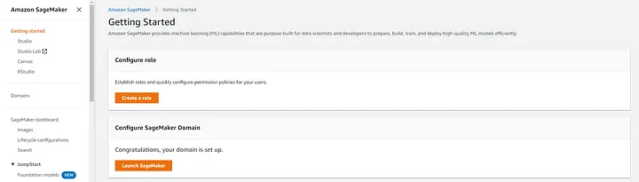

2. You will need to Configure a SageMaker Domain to launch Studio from. We will be using the Quick Setup option for this module.

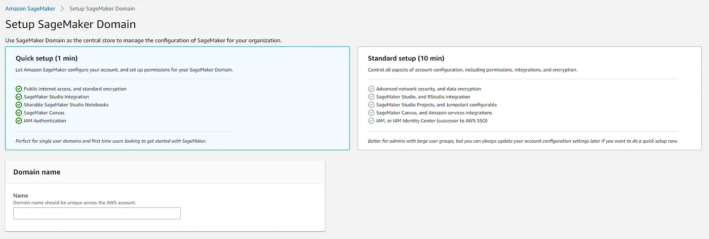

3. Select Studio from the navigation panel and Open a Studio session.

4. In the SageMaker Resources tab, click Create project and select the MLOps template for model building, training, and deployment. This template provides all the code necessary to configure and launch ML lifecycle management services. We will edit various aspects of this template to accommodate our custom training and inference code.

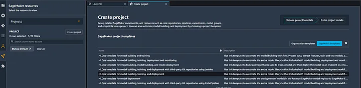

5. You’ll need to clone the two project repositories. One corresponds to the model building, and the other is for model deployment. CodeCommit will manage the repositories, a version control service similar to GitHub.

6. We will download our customer churn dataset into an AWS S3 bucket. We will point to this bucket in our scripts. To download the data, create a notebook in any directory of your SageMaker project and execute the following code in a Jupyter cell.

```
!aws s3 cp s3://sagemaker-sample-files/datasets/tabular/synthetic/churn.txt ./
import os
import boto3
import sagemaker
prefix = 'sagemaker/DEMO-xgboost-churn'
region = boto3.Session().region_name
default_bucket = sagemaker.session.Session().default_bucket()
role = sagemaker.get_execution_role()
RawData = boto3.Session().resource('s3')\
.Bucket(default_bucket).Object(os.path.join(prefix, 'data/RawData.csv'))\
.upload_file('./churn.txt')
print(os.path.join("s3://",default_bucket, prefix, 'data/RawData.csv'))
```

7. We need to make a few changes to adapt the SageMaker template to our customer churn solution. Our goal with this customer churn model is to predict whether a user will unsubscribe from a service in the future.

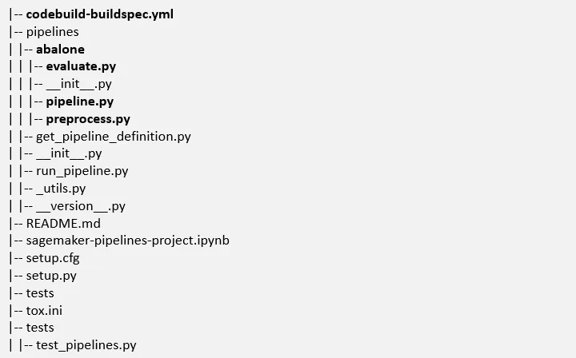

Let’s review the main folders and files we will be working with. The adapted version of these scripts can be found in the GitHub Repo. In the interest of time, feel free to copy the code in the repo to update pipeline.py, preprocess.py, evaluate.py, and codebuild-specbuild.yml.

- The [pipelines folder](https://github.com/intel/sagemaker-intel-aws-xgboost/tree/main/pipeline-code/0_model-development/pipelines) contains the python scripts that orchestrate and execute the various components of our model-building pipeline. You will need to rename the “abalone” folder in this directory to “customer_churn”
- The [evaluate.py script](https://github.com/intel/sagemaker-intel-aws-xgboost/blob/main/pipeline-code/0_model-development/pipelines/customer_churn/evaluate.py) evaluates our model against a validation dataset. In this example, we use MSE, but you could adapt this to other appropriate metrics.
- The [preprocess.py script](https://github.com/intel/sagemaker-intel-aws-xgboost/blob/main/pipeline-code/0_model-development/pipelines/customer_churn/preprocess.py) performs various data processing and feature engineering steps like one-hot encoding and normalization. You can adapt this by injecting additional processing steps to fit your solution.
- The [pipeline.py script](https://github.com/intel/sagemaker-intel-aws-xgboost/blob/main/pipeline-code/0_model-development/pipelines/customer_churn/pipeline.py) orchestrates your entire SageMaker model-building pipeline. It loads machine images, specifies compute instances, and pulls from appropriate data sources. It can take some time to understand the ins and outs of this script, but it’s relatively simple once you get the hang of it. Start by editing the following:
  - S3 location (line 95)
  - custom image URI (line 121) — the steps for building a custom image are discussed in detail in this accompanying article: [Guide to Implementing Custom Accelerated AI Libraries in SageMaker with oneAPI and Docker](https://medium.com/@eduand-alvarez/guide-to-implementing-custom-accelerated-ai-libraries-in-sagemaker-with-oneapi-and-docker-97547692cb6e).
  - your pipeline name (line 70)
  - The [codebuild-specbuild.yml](https://github.com/intel/sagemaker-intel-aws-xgboost/blob/main/pipeline-code/0_model-development/codebuild-buildspec.yml) configures your build upon pushing a change to your CodeCommit Repo.

7. Once we finish editing those four files and configuring our custom training/serving image, we can push our changes to our repo. Since our template comes pre-configured with CI/CD, this will automatically execute the pipeline and train a model.
- Select the GIT tab from the side navigation panel and, select the files you have modified to add to the staging area and commit, then push changes to the remote repository.

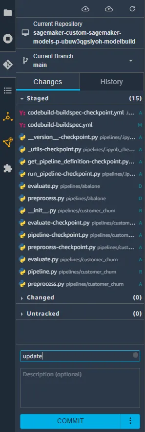

- To check if your CI/CD automation has properly triggered the build, you can go to AWS CodeCommit and select build history from the navigation panel. You should see a build run with an “in progress” status.

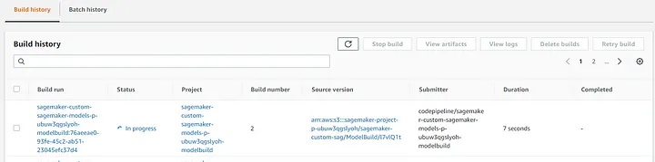

- Go to SageMaker Resources and select your project. From the pipeline tab, you can check the status of pipeline execution; you will find one Succeeded job, which was automatically executed when we cloned the template repos. You should also see a pipeline in Executing status, and you can double-click this to explore more details about your execution.

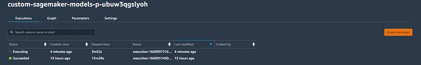

- You can monitor the progress of your pipeline with the visual graph representation. Clicking the nodes opens an execution metadata panel that includes inputs, outputs, and execution logs.

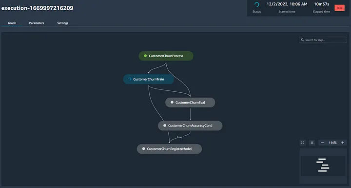

Upon successful completion of the pipeline, a model will be created. You access your model inside of the model group project tab.

## Endpoints and Inference Jobs

SageMaker endpoints are created automatically by your pipeline and are responsible for handling the inference component.

1. Since our model approval condition is set to “manual,” we will have to approve our model manually. When a model is approved, this will invoke a CloudFormation stack that creates a SageMaker model, SageMaker endpoint config, and SageMaker inference endpoint. All of these components can be tracked inside the central SageMaker AWS console. The code responsible for this automation can be found in the model deployment repo we cloned at the beginning of the module.

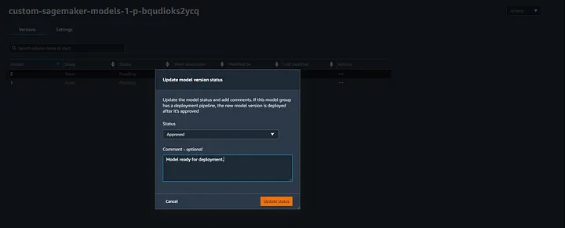

2. Check the status of your endpoint build in the sagemaker. Navigate to SageMaker Inference and select Endpoints. You can select View Logs to review event data from your endpoint on CloudWatch. 

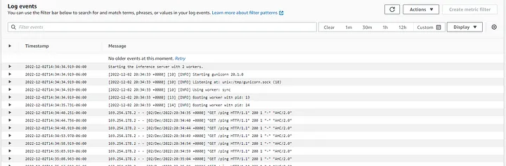

Another Good QC point is to check if your Endpoint is marked as “In-Service” in the Endpoint dashboard. 

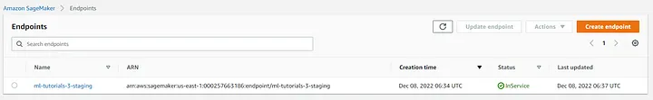

## Setting up Lambda Function to Process API Requests
AWS Lambda functions prevent us from setting up dedicated servers for monitoring requests and executing small pieces of code like formatting and endpoint invocations. There are significant benefits to this, like only paying for the computer when the functions are triggered instead of a dedicated server which will bill us a reserved or on-demand cost.

The steps to build the lambda function for this particular module are discussed in detail in this accompanying article: [Guide to Building AWS Lambda Functions from ECR Images to Manage SageMaker Inference Endpoints](https://medium.com/@eduand-alvarez/guide-to-building-aws-lambda-functions-from-ecr-images-to-manage-sagemaker-inference-endpoints-4980a9b92290).

## Building a REST API using API Gateway

Configuring a REST API will allow us to send HTTP protocol requests to our SageMaker endpoint. The following steps outline how to achieve this using AWS API Gateway.


1. Navigate to API Gateway and select “Build” from the REST API section.

2. Select REST, New API, and fill the API settings section with your name and endpoint type. Once complete, click Create.

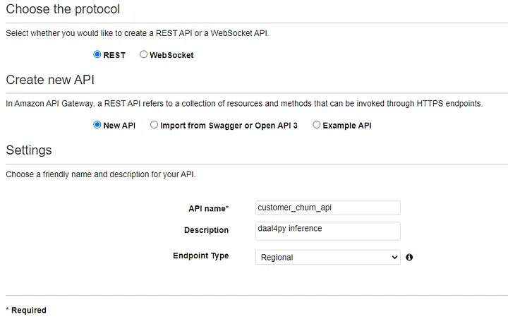

3. Go to the Actions dropdown and select Create Resource. Once complete, click Create Resource.

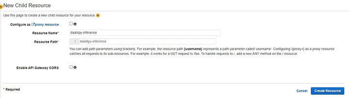

4. Go to the Actions dropdown and select Create Method. Select POST. Retrieve the name of the lambda function that you configured in the previous section and provide the same region as the rest of your resources.

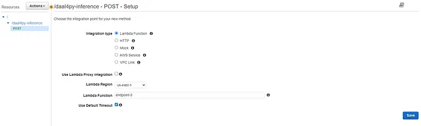

Upon creation of your gateway, you will be prompted with a diagram of your API architecture.

5. You can deploy the API by clicking on the Actions tab and selecting the Deploy API option. This will provide you with a link that you can use to send Post requests to your Model endpoint.

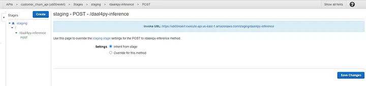

## Testing your new API

Create a free Postman account at https://web.postman.co/

We can use Postman to create REST API requests to test our new API.

Create a new test in Postman, paste the link you created from your REST API, select Body as the input type and POST as the request type, and provide the input data.

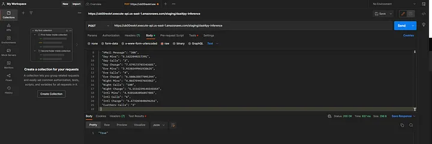

If you’ve completed all of the steps in this module, you should get a “True” response from your API.

## Conclusion and Discussion
Congratulations! You have built a custom MLOps pipeline on SageMaker with oneAPI hardware-accelerated libraries. Using the information in this module, you can build end-to-end machine-learning pipelines in SageMaker and leverage hardware-optimized machine-learning libraries like daal4py.

We encourage readers to watch for upcoming workshops and future Intel Cloud Optimization Modules (ICOMs), as leveraging the Intel optimizations in these modules can qualify their applications for an “Accelerated by Intel” badge.

Our goal with ICOMs is to help developers enhance the performance and scalability of their applications with intel software and hardware. With the increasing demand for high-performance cloud applications, it is crucial for developers to stay informed and utilize the latest technologies and tools available to them.

The instructions above were sourced from this Optimization Module's associated Medium articles (linked Below)

### Associated Medium Articles
- [Guide to Building AWS Lambda Functions from ECR Images to Manage SageMaker Inference Endpoints](https://medium.com/@eduand-alvarez/guide-to-building-aws-lambda-functions-from-ecr-images-to-manage-sagemaker-inference-endpoints-4980a9b92290)
- [Guide to Implementing Custom Accelerated AI Libraries in SageMaker with oneAPI and Docker](https://medium.com/@eduand-alvarez/guide-to-implementing-custom-accelerated-ai-libraries-in-sagemaker-with-oneapi-and-docker-97547692cb6e)
- [A Detailed Guide for Building Hardware Accelerated MLOps Pipelines in SageMaker](https://medium.com/@eduand-alvarez/a-detailed-guide-for-building-hardware-accelerated-mlops-pipelines-in-sagemaker-5d32459665b3)
